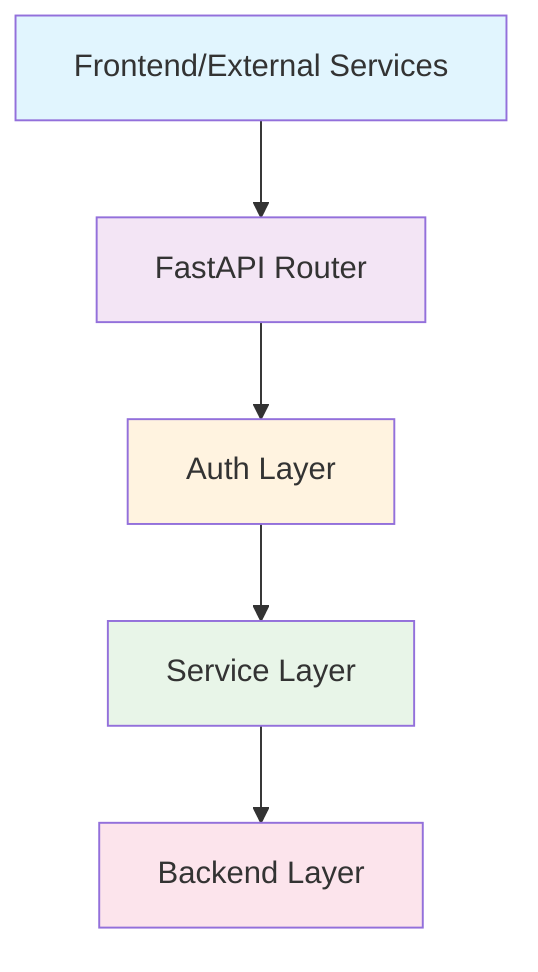

# aibtcdev-backend

[](https://github.com/RichardLitt/standard-readme)

> A sophisticated FastAPI backend powering AI-driven Stacks blockchain DAO management and trading capabilities.

aibtcdev-backend provides comprehensive DAO proposal management, DEX trading integration, agent account operations, and blockchain event processing for the Stacks ecosystem with AI-powered analysis and automation.

**⚠️ Disclaimer**: aibtc.dev is not liable for any lost, locked, or mistakenly sent funds. This is alpha software—use at your own risk. Any STX sent to you is owned by you, the trader, and may be redeemed, including profits or losses, at the end of the aibtc.dev Champions Sprint (~5 days). By participating, you accept that aibtc.dev is not responsible for any product use, costs, taxes incurred from trading STX or any other digital asset, or any other liability.

## Table of Contents

- [Background](#background)
- [Features](#features)
- [Architecture](#architecture)
- [Quick Start](#quick-start)
- [Documentation](#documentation)
- [Maintainers](#maintainers)
- [Contributing](#contributing)
- [License](#license)

## Background

aibtcdev-backend bridges AI capabilities with Stacks blockchain technology to create intelligent DAO management experiences. The system provides AI agents that can autonomously interact with DAOs, create and evaluate proposals, execute trades, and manage blockchain accounts through a comprehensive REST API.

The platform is designed with a dual-mode architecture:
- **Web Server Mode**: Handles API requests for tool execution and webhook processing
- **Worker Mode**: Runs background services including job processing and bot integrations

## Features

### 🏛️ DAO Management
- **Proposal Creation**: Automated DAO action proposal generation with AI-enhanced metadata
- **Voting Operations**: Create, vote on, and veto DAO proposals
- **Agent Accounts**: Manage agent accounts for autonomous DAO participation
- **Contract Approval**: Enable agent accounts to interact with specific contracts
- **Proposal Recommendations**: AI-generated contextual proposal suggestions

### 💰 Trading & Finance
- **DEX Integration**: Automated token purchases on Faktory DEX
- **Wallet Management**: Multi-network wallet support (mainnet/testnet)
- **Faucet Integration**: Testnet STX and sBTC token funding
- **Slippage Control**: Configurable slippage tolerance for trades

### 🧠 AI-Powered Analysis
- **Proposal Recommendations**: Generate contextual proposal suggestions based on DAO history
- **Comprehensive Evaluation**: Multi-faceted AI analysis of proposals with custom prompts
- **Metadata Generation**: Automatic title, summary, and tag generation for proposals

### 🔗 Blockchain Integration
- **Stacks Network**: Native support for Stacks blockchain operations
- **Transaction Processing**: Automated transaction creation and broadcasting
- **Event Processing**: Webhook-based blockchain event handling
- **Multi-Network**: Support for both testnet and mainnet configurations

### 🛠️ Developer Experience
- **Tool Discovery**: Dynamic tool registration and discovery system
- **Multiple Auth**: Bearer tokens and API keys authentication
- **Social Integration**: Twitter/X embedding with CORS proxy support
- **Comprehensive API**: RESTful endpoints for all operations

## Architecture

### Dual-Mode System

**Web Server Mode (`main.py`)**:
- FastAPI application with CORS configuration
- RESTful API endpoints for tools and webhooks
- Health monitoring and status endpoints

**Worker Mode (`worker.py`)**:
- Background job processing and execution
- Telegram bot integration (when enabled)
- System metrics monitoring and alerting
- Standalone service operations

### Service Layer Architecture



## Quick Start

### Prerequisites

- Python 3.13
- [UV](https://docs.astral.sh/uv/) (modern Python package manager)
- [Bun](https://bun.sh/) (for TypeScript tools)
- Git with submodule support

### Installation

```bash
# Clone repository with submodules
git clone <repository-url>
cd aibtcdev-backend
git submodule init && git submodule update --remote

# Install UV (if needed)
curl -LsSf https://astral.sh/uv/install.sh | sh

# Setup environment
uv sync
source .venv/bin/activate

# Configure environment
cp .env.example .env
# Edit .env with your settings

# Install TypeScript tools
cd agent-tools-ts/ && bun install && cd ..
```

### Running the Application

**Web Server Mode**:
```bash
uvicorn app.main:app --host 0.0.0.0 --port 8000 --reload
```

**Worker Mode**:
```bash
python -m app.worker
```

Access the application:
- **API**: `http://localhost:8000`
- **Documentation**: `http://localhost:8000/docs`
- **Health Check**: `http://localhost:8000/`

## Documentation

Comprehensive documentation is available in the `docs/` directory:

### 📖 Core Documentation
- **[API Overview](docs/api-overview.md)**: Complete API endpoint reference with usage examples
- **[Authentication](docs/authentication.md)**: Authentication methods and security
- **[Configuration](docs/configuration.md)**: Environment setup and configuration
- **[Development](docs/development.md)**: Development setup and contribution guide
- **[CLI Usage](docs/cli-usage.md)**: Command-line interface guide for task management

### 🔧 Quick References
- **API Endpoints**: See [API Overview](docs/api-overview.md) for complete endpoint list and examples
- **Authentication**: See [Authentication](docs/authentication.md) for auth methods
- **Environment Setup**: See [Configuration](docs/configuration.md) for all settings
- **CLI Commands**: See [CLI Usage](docs/cli-usage.md) for task running instructions

## Maintainers

[@aibtcdev](https://github.com/aibtcdev)

## Contributing

We welcome contributions! Please see our [Development Guide](docs/development.md) for detailed information.

### Quick Contributing Steps

1. **Fork** the repository
2. **Create** a feature branch (`git checkout -b feature/amazing-feature`)
3. **Make** your changes with tests
4. **Format** code (`ruff format .`)
5. **Test** your changes (`pytest`)
6. **Commit** changes (`git commit -m 'Add amazing feature'`)
7. **Push** to branch (`git push origin feature/amazing-feature`)
8. **Open** a Pull Request

### Guidelines

- Follow Python code style using `ruff`
- Add tests for new features
- Update documentation as needed
- Keep pull requests focused and atomic
- Ensure async code is properly tested

For detailed development setup and workflows, see [Development Documentation](docs/development.md).

## License

[MIT](LICENSE) aibtcdev