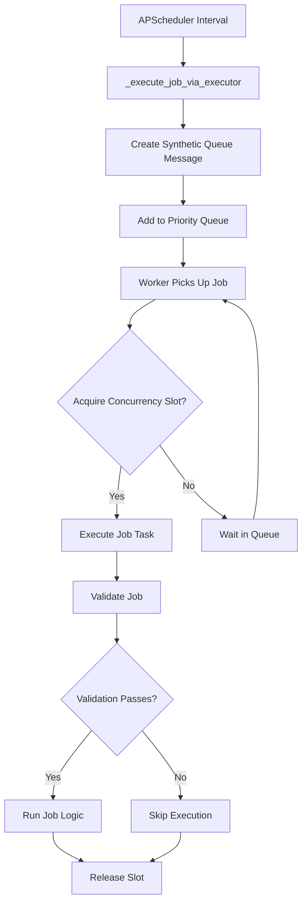

# Job Runner System - Auto-Discovery

The job runner system uses **auto-discovery** to make adding new jobs incredibly simple. All job types are dynamically registered - there are no hardcoded job types!

## How It Works

The system automatically:
1. 🔍 **Discovers** all task files in `services/runner/tasks/`
2. 📝 **Registers** jobs decorated with `@job`
3. 🏗️ **Creates** JobType enums dynamically
4. ⚙️ **Configures** scheduling and execution
5. 🔄 **Schedules** jobs with APScheduler
6. 🏃 **Executes** jobs through multi-worker executor

**No hardcoded job types!** Everything is discovered at runtime through the `@job` decorator.

## Job Execution Architecture

### 🎯 **Multi-Level Concurrency Control**

The system implements **three levels** of concurrency control to ensure efficient and safe job execution:

#### 1. **APScheduler Level** (Prevents Overlapping Triggers)
```python
scheduler.add_job(
    max_instances=1,  # Prevent same job triggering multiple times
    misfire_grace_time=60,  # Skip missed executions if system is busy
)
```

#### 2. **Job Type Level** (Respects max_concurrent Settings)
```python
@job(max_concurrent=2)  # Max 2 instances of this job type running
```

#### 3. **Worker Pool Level** (5 Workers Handle All Jobs)
- Multiple workers can run **different job types** simultaneously
- Same job type limited by `max_concurrent` semaphores
- Priority-based job scheduling

### 🔄 **Job Execution Flow**



### 📋 **Two Job Execution Patterns**

#### **Pattern 1: Self-Contained Scheduled Jobs**
Jobs that run independently without needing database queue messages:

```python
@job("chain_state_monitor", interval_seconds=90, max_concurrent=2)
class ChainStateMonitorTask(BaseTask[ChainStateMonitorResult]):
    async def _validate_task_specific(self, context: JobContext) -> bool:
        return True  # Always valid - checks blockchain state
    
    async def _execute_impl(self, context: JobContext) -> List[ChainStateMonitorResult]:
        # Fetch blockchain data and process
        return results
```

**Examples:** `chain_state_monitor`, `dao_proposal_embedder`, `dao_proposal_conclude`

#### **Pattern 2: Queue-Processing Jobs**
Jobs that process messages from the database queue:

```python
@job("tweet", interval_seconds=30, max_concurrent=2)
class TweetTask(BaseTask[TweetProcessingResult]):
    async def _validate_task_specific(self, context: JobContext) -> bool:
        pending_messages = backend.list_queue_messages(
            filters=QueueMessageFilter(type=QueueMessageType.TWEET, is_processed=False)
        )
        return len(pending_messages) > 0  # Only run if messages exist
    
    async def _execute_impl(self, context: JobContext) -> List[TweetProcessingResult]:
        # Process pending tweet messages
        return results
```

**Examples:** `tweet`, `discord`, `dao_deployment`, `agent_account_deployer`

### ⚡ **Concurrency Examples**

With 5 workers and these job settings:
- `tweet`: `max_concurrent=2` 
- `discord`: `max_concurrent=3`
- `chain_state_monitor`: `max_concurrent=2`

**Possible Simultaneous Execution:**
- ✅ Worker-1: `tweet` job #1
- ✅ Worker-2: `tweet` job #2  
- ❌ Worker-3: `tweet` job #3 (waits - max_concurrent exceeded)
- ✅ Worker-3: `discord` job #1 (different type)
- ✅ Worker-4: `discord` job #2
- ✅ Worker-5: `chain_state_monitor` job #1

## Adding a New Job (Super Easy!)

### Step 1: Create Your Task File
Create a new `.py` file in `services/runner/tasks/`. That's it for file creation!

### Step 2: Use the @job Decorator
```python
from dataclasses import dataclass
from typing import List

from ..base import BaseTask, JobContext, RunnerResult
from ..decorators import JobPriority, job

@dataclass
class MyJobResult(RunnerResult):
    """Result of my job processing."""
    items_processed: int = 0

@job(
    "my_awesome_job",  # ✨ Job type - automatically creates JobType.MY_AWESOME_JOB
    name="My Awesome Job",
    description="Does awesome things",
    interval_seconds=120,
    priority=JobPriority.NORMAL,
    max_concurrent=2,
    requires_twitter=True,  # Optional: specify requirements
    enabled=True,  # Optional: enable/disable
)
class MyAwesomeJobTask(BaseTask[MyJobResult]):
    """My awesome job task."""
    
    async def _execute_impl(self, context: JobContext) -> List[MyJobResult]:
        # Your job logic here
        return [MyJobResult(success=True, message="Done!", items_processed=10)]
```

### Step 3: That's It!
Your job is automatically:
- ✅ Discovered and registered
- ✅ JobType enum created dynamically
- ✅ Scheduled with APScheduler
- ✅ Added to executor pipeline
- ✅ Respects concurrency limits
- ✅ Configurable via environment/config

## Dynamic Job Types

🚀 **All job types are dynamic!** No more hardcoded enums or manual registration.

- Job types are created automatically when you use `@job("job_type_name")`
- The system supports any job type name you want
- JobType enums are generated at runtime
- No conflicts or duplicates - each job type is unique

## Configuration

Jobs can be configured via environment variables or config files:

```bash
# Enable/disable a job
MY_AWESOME_JOB_ENABLED=true

# Override interval
MY_AWESOME_JOB_INTERVAL_SECONDS=300

# Alternative naming pattern (backwards compatibility)
MY_AWESOME_JOB_RUNNER_ENABLED=true
MY_AWESOME_JOB_RUNNER_INTERVAL_SECONDS=300
```

## Job Decorator Options

The `@job` decorator supports many options:

```python
@job(
    "job_type",                    # Required: unique job identifier
    name="Human Readable Name",    # Optional: display name
    description="What it does",    # Optional: description
    
    # Scheduling
    interval_seconds=60,           # How often to run
    enabled=True,                  # Enable/disable
    
    # Execution
    priority=JobPriority.NORMAL,   # LOW, NORMAL, HIGH, CRITICAL
    max_retries=3,                 # Retry attempts
    retry_delay_seconds=30,        # Delay between retries
    timeout_seconds=300,           # Execution timeout
    
    # Concurrency
    max_concurrent=1,              # Max parallel executions
    batch_size=10,                 # Items per batch
    
    # Requirements
    requires_wallet=True,          # Needs wallet access
    requires_twitter=True,         # Needs Twitter API
    requires_discord=True,         # Needs Discord API
    
    # Advanced
    dependencies=["other_job"],    # Job dependencies
    preserve_order=False,          # Order sensitive?
    idempotent=True,              # Safe to retry?
)
```

## System Startup and Lifecycle

### 🚀 **Initialization Sequence**
1. **Auto-Discovery** - Scan `tasks/` directory and register jobs
2. **Job Scheduling** - Schedule enabled jobs with APScheduler  
3. **Scheduler Start** - Start APScheduler to begin triggering jobs
4. **Executor Start** - Start 5-worker executor pool
5. **Concurrency Setup** - Initialize semaphores for each job type

### 📊 **Runtime Monitoring**
The system provides comprehensive monitoring:
- **Job Metrics** - Execution counts, success rates, timing
- **Health Status** - System health and performance alerts
- **Concurrency Stats** - Active jobs per type, slot usage
- **Performance Monitoring** - Execution times, failure rates

### 🛑 **Graceful Shutdown**
1. **Stop Scheduler** - No new job triggers
2. **Stop Executor** - Complete running jobs, reject new ones
3. **Cancel Workers** - Gracefully terminate worker tasks
4. **Cleanup Resources** - Release connections and memory

## Migration from Old System

### Before (Manual Registration Required)
1. Add job type to hardcoded `JobType` enum in `base.py`
2. Add config mapping in `job_manager.py`
3. Import and register in `__init__.py`
4. Export in `tasks/__init__.py`
5. Create the task class

### After (Auto-Discovery)
1. Create task file with `@job` decorator
2. Done! 🎉

## Benefits

- 🚀 **Faster development**: No manual registration steps
- 🛡️ **Less error-prone**: No forgetting to register
- 🔧 **Self-documenting**: All config in one place
- 🌟 **Consistent**: Same pattern for all jobs
- 🎯 **Dynamic**: Job types created automatically
- 🔄 **No hardcoded types**: Everything discovered at runtime
- ⚡ **Efficient**: Multi-level concurrency control
- 📊 **Observable**: Built-in monitoring and metrics
- 🔒 **Safe**: Prevents resource exhaustion and overlapping executions

## Examples

Check out existing task files for patterns:
- `chain_state_monitor.py` - Self-contained scheduled monitoring
- `tweet_task.py` - Queue-based message processing with media
- `discord_task.py` - Webhook integration with error handling
- `dao_proposal_embedder.py` - AI service integration
- `dao_deployment_task.py` - Complex workflow with validation
- `agent_account_deployer.py` - Blockchain deployment with retry logic

## Troubleshooting

### Job Not Appearing?
1. Check file is in `services/runner/tasks/`
2. Check `@job` decorator is present
3. Check no syntax errors in task file
4. Check logs for import errors
5. Verify job is enabled in configuration

### Jobs Not Running?
1. Check if scheduler is started: `scheduler.running`
2. Check if executor is running: `job_manager.is_running`
3. Check job validation: jobs may be skipping execution
4. Check concurrency limits: jobs may be waiting for slots
5. Check for errors in job logs

### Configuration Not Working?
1. Use naming pattern: `{job_type}_enabled` or `{job_type}_interval_seconds`
2. Check environment variables
3. Check config file settings
4. Verify job metadata is being overridden

### Performance Issues?
1. Check `max_concurrent` settings - too high can overwhelm resources
2. Monitor job execution times - increase timeout if needed  
3. Check for resource contention between jobs
4. Review job validation logic - expensive validation can slow scheduling
5. Use performance monitoring to identify bottlenecks

### Need Help?
- Look at existing task examples
- Check the auto-discovery logs
- Use `JobRegistry.list_jobs()` to see registered jobs
- Check dynamic job types with `JobType.get_all_job_types()`
- Monitor system health with `job_manager.get_system_health()`
- Review job metrics with `job_manager.get_job_metrics()`

## Advanced Topics

### Custom Job Validation
Override validation methods for complex job requirements:

```python
async def _validate_config(self, context: JobContext) -> bool:
    # Check configuration requirements
    return True

async def _validate_resources(self, context: JobContext) -> bool:
    # Check external resources (APIs, databases, etc.)
    return True

async def _validate_prerequisites(self, context: JobContext) -> bool:
    # Check dependencies and prerequisites  
    return True

async def _validate_task_specific(self, context: JobContext) -> bool:
    # Task-specific validation logic
    return True
```

### Error Handling and Retries
Implement custom error handling:

```python
def _should_retry_on_error(self, error: Exception, context: JobContext) -> bool:
    # Custom retry logic based on error type
    return isinstance(error, (ConnectionError, TimeoutError))

async def _handle_execution_error(
    self, error: Exception, context: JobContext
) -> Optional[List[MyJobResult]]:
    # Custom error recovery
    if "temporary" in str(error).lower():
        return None  # Let retry system handle it
    return [MyJobResult(success=False, message=f"Unrecoverable: {error}")]
```

### Priority and Dependencies
Use priority and dependencies for complex workflows:

```python
@job(
    "high_priority_job",
    priority=JobPriority.CRITICAL,  # Runs before NORMAL priority jobs
    dependencies=["prerequisite_job"],  # Wait for other jobs
    preserve_order=True,  # Execute in specific order
)
``` 